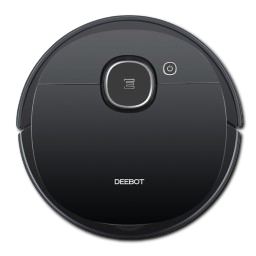

# ioBroker.ecovacs-deebot




[](https://www.npmjs.com/package/iobroker.ecovacs-deebot)


This adapter uses the [ecovacs-deebot.js](https://github.com/mrbungle64/ecovacs-deebot.js) library.

> **⚠️ Maintenance Status: Community-Driven Project**
> This adapter is now following a **Community-Driven** maintenance model. The maintainer focuses on the core engine and personally owned devices. Support for all other models depends entirely on community contributions (Pull Requests).

---

## 🗺️ Roadmap & Strategy

To ensure long-term maintainability, we are streamlining the adapter's architecture. **Note: We are currently in the 1.4.x release cycle.**

1. **Phase 1 (Planned): Final Legacy Support (Adapter v1.4.15 / Library v0.9.6)**
   * This will be the final "safe harbor" for all legacy devices using XML protocols (XMPP/XML or MQTT/XML).
   * Once released, no new legacy features will be added.
2. **Phase 2 (Planned): Modernization (Adapter v2.0.x / Library v1.0.0)**
   * Transition to a **Pure MQTT/JSON** stack.
   * Complete removal of legacy code to improve performance and stability.
   * **Breaking Change:** Legacy models (e.g., OZMO 930, Deebot 900) will no longer be supported in v2.x.

---

## Models & Support Tiers

Support is divided into tiers based on device availability for the maintainer:

| **Tier** | **Model Series (Examples)** | **Status** |
| :--- | :--- | :--- |
| 🟢 Active | OZMO 920/950, T8 AIVI, X1 Turbo | **Fully Supported.** Devices owned by the maintainer |
| 🟡 Community | T10, T20, T30, X2, X8 etc. | **Best Effort.** Supported via community Pull Requests |
| 🔴 Legacy | OZMO 930, Deebot 900/901 etc. | **Maintenance Only.** Supported in **v1.5.x only** |

### How to get your model supported?
If you own a modern (MQTT/JSON) model that is currently not supported:
1. Check the [ecovacs-deebot.js](https://github.com/mrbungle64/ecovacs-deebot.js) library.
2. Provide a **Pull Request** with the necessary model definitions.
3. In addition to the library, there may be new functions or states that need to be implemented in the adapter itself.
4. **Requests for new models without a Pull Request will be closed without further notice.**

#### Library vs. Adapter responsibilities
To support a new model, usually changes are needed in both parts:

*   **[ecovacs-deebot.js (Library)](https://github.com/mrbungle64/ecovacs-deebot.js)**
    *   **Protocol & Communication:** Handling the low-level connection (MQTT/JSON).
    *   **Model Definitions:** Defining which commands and events a specific model supports.
    *   **Data Parsing:** Translating raw device messages into meaningful data structures.
*   **ioBroker.ecovacs-deebot (Adapter)**
    *   **State Management:** Creating and maintaining the ioBroker object tree (states like `control.clean`, `info.battery`, etc.).
    *   **Event Mapping:** Linking library events to the corresponding ioBroker states.
    *   **Extended Logic:** Implementing complex features or specific ioBroker-side helpers.

---

## Changelog

### 2.0.x (alpha)
- **Breaking Change: Multi-Device Architecture**
  - Manage all account devices in a single instance instead of running separate adapter instances
  - Per-device feature configuration: the **Devices** tab is auto-populated from the devices on your account, so feature toggles can be set individually per device (see [DOCUMENTATION.md](DOCUMENTATION.md#configuration-admin-ui))
  - Automatic native config migration on startup (removes legacy dot-notation keys and the `deviceNumber` setting)
- **Breaking Change: No new features for legacy devices**
  - Transition to a **Pure MQTT/JSON**
  - Legacy models (e.g., OZMO 930, Deebot 900, U2 series) will no longer work or be supported
- **Architectural Modernization & Quality Assurance**
  - Completely refactored codebase
  - Created a robust test suite with 80%+ code coverage for unit and integration testing

### 1.4.16 (alpha)
- Breaking change: Bump minimum required version of Node.js to 20.x
- Add more states for air drying timer
- Use adapter-dev module
- Some further improvements and optimizations
- Bumped ecovacs-deebot.js to 0.9.6 (latest beta)
- Bumped several other dependencies
 
### 1.4.15 (latest stable)
- Breaking change: Bump minimum required version of Node.js to 18.x
- Bumped ecovacs-deebot.js to 0.9.6 (beta)
- Add state (button) for manually requesting the cleaning log
- Separate mopping and scrubbing mode
- Add states for air drying timer
- Some further improvements and optimizations

### 0.0.1 - 1.4.14
* [Changelog archive](https://github.com/mrbungle64/ioBroker.ecovacs-deebot/wiki/Changelog-(archive))

---

## Installation & Prerequisites

* **Node.js:** >= 20.x (since v1.4.16)
* **ioBroker:** Stable installation
* **Optional:** `canvas` for map rendering (see [Wiki](https://github.com/mrbungle64/ioBroker.ecovacs-deebot/wiki) for details).

### 🐳 Docker / Container Deployment

The repository includes a `Dockerfile` and `docker-compose.yml` configured to run the adapter inside a [buanet/iobroker](https://github.com/buanet/docker-iobroker) container.

To automatically configure the Ecovacs adapter instance on the first start of the container using a `.env` file:

1. **Copy the example environment file:**
   ```bash
   cp .env.example .env
   ```
2. **Open `.env` and fill in your credentials:**
   ```env
   ECOVACS_EMAIL=your-email@example.com
   ECOVACS_PASSWORD=your-password
   ECOVACS_COUNTRY=de
   ```
3. **Start the container:**
   ```bash
   docker compose up -d
   ```

The initialization script will automatically register, configure, and start the adapter instance using these credentials. The password is automatically encrypted by ioBroker's `js-controller` on first run.

## Disclaimer
I am in no way affiliated with Ecovacs Robotics Co., Ltd. or yeedi Technology Limited. This is a private hobby project.

## License
MIT License - Copyright (c) 2026 Sascha Hölzel